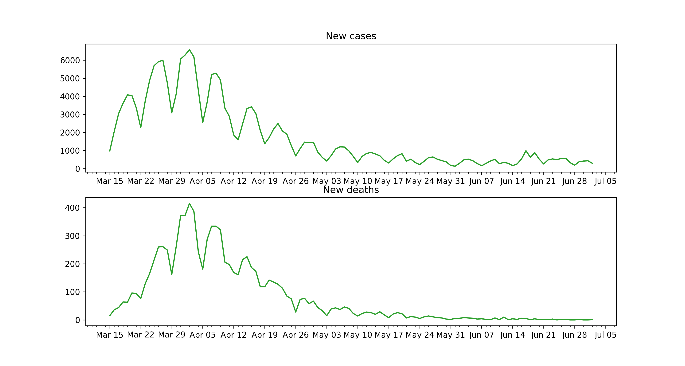

Plotting
========

We provide a lot of plotting functions which can be used to recreate our plots or
create completely new visualizations. If you are familiar with ``matplotlib`` it should
be no problem to use them extensively.

We provide three different types of functions here:

* `High level functions`_ These can be used create figures similar to our paper Dehning et al. arXiv:2004.01105. The are neat little one liners which create a good looking plot from our model, but do not have a lot of customization options.

* `Low level functions`_  These extend the normal ``matplotlib`` plotting functions and can be used to plot arbitrary data. They have a lot of customization options, it could take some time to get nicely looking plots with these functions though.

* `Helper functions`_ These are mainly functions that manipulate data or retrieve data from our model. These do not have to be used most of the time and are only documented here for completeness. 

If one just wants to recreate our figures with a different color. The easiest was is to change the default rc parameters.

.. autofunction:: covid19_inference.plot.get_rcparams_default
.. autofunction:: covid19_inference.plot.set_rcparams

High level functions
--------------------
.. autofunction:: covid19_inference.plot.timeseries_overview

Low level functions
-------------------

.. autofunction:: covid19_inference.plot._timeseries

.. autofunction:: covid19_inference.plot._distribution

Example
^^^^^^^
In this example we want to use the low level time series function to plot the new daily cases and deaths reported by the Robert Koch institute.

.. code-block:: python

    import datetime
    import matplotlib.pyplot as plt
    import covid19_inference as cov19

    # Data retrieval i.e. download new data from RobertKochInstitue
    rki = cov19.data_retrieval.RKI()
    rki.download_all_available_data()

    new_deaths = rki.get_new(
        value = "deaths",
        data_begin=datetime.datetime(2020,3,15), #arbitrary data
        data_end=datetime.datetime.today())

    new_cases = rki.get_new(
        value = "confirmed",
        data_begin=datetime.datetime(2020,3,15),
        data_end=datetime.datetime.today())

    # Create a multiplot
    fig, axes = plt.subplots(2,1, figsize=(12,6))

    # Plot the new cases onto axes[0]
    cov19.plot._timeseries(
        x=new_cases.index,
        y=new_cases,
        ax=axes[0],
        what="model", #We define model here to get a line instead of data points
    )

    # Plot the new deaths onto axes[1]
    cov19.plot._timeseries(
        x=new_deaths.index,
        y=new_deaths,
        ax=axes[1],
        what="model", #We define model here to get a line instead of data points
    )   

    # Label the plots

    axes[0].set_title("New cases")

    axes[1].set_title("New deaths")

    # Show the figure
    fig.show()
..

Helper functions
----------------

.. autofunction:: covid19_inference.plot._get_array_from_trace_via_date
.. autofunction:: covid19_inference.plot._new_cases_to_cum_cases
.. autofunction:: covid19_inference.plot._label_for_varname
.. autofunction:: covid19_inference.plot._math_for_varname
.. autofunction:: covid19_inference.plot._days_to_mpl_dates
.. autofunction:: covid19_inference.plot._get_mpl_text_coordinates
.. autofunction:: covid19_inference.plot._add_mpl_rect_around_text

.. autofunction:: covid19_inference.plot._rx_cp_id
.. autofunction:: covid19_inference.plot._rx_hc_id
.. autofunction:: covid19_inference.plot._format_k
.. autofunction:: covid19_inference.plot._format_date_xticks
.. autofunction:: covid19_inference.plot._truncate_number
.. autofunction:: covid19_inference.plot._string_median_CI
.. autofunction:: covid19_inference.plot._add_watermark
.. autoclass:: covid19_inference.plot.Param